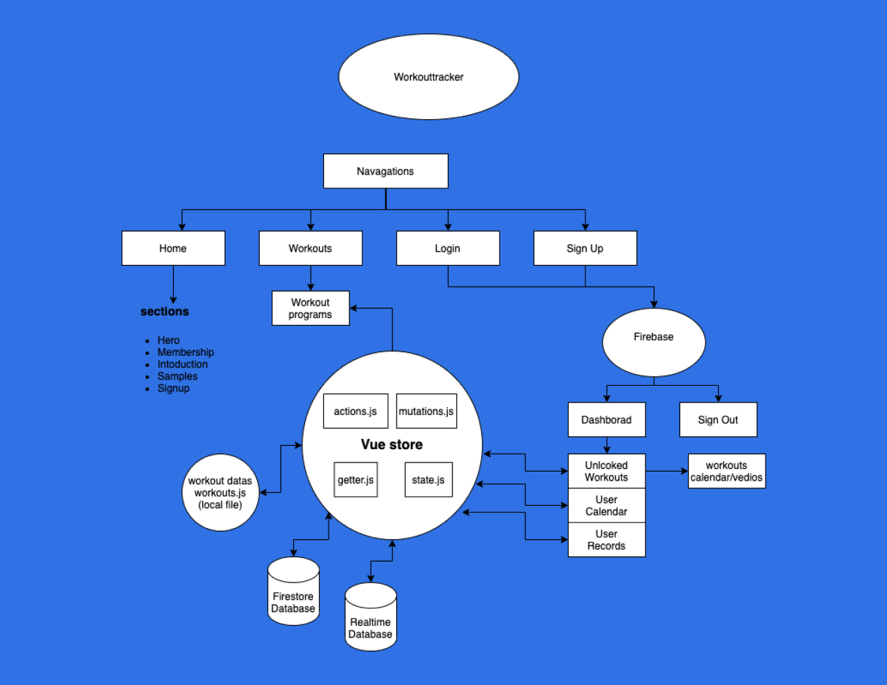

# Technologies Used
* Vue/VueX
* CSS3
* HTML5
* Vuetify
* Stripe
* PayPal
* Sass
* Animate.css(Animation)
* Firebase(Database, Authentication & Hosting)

## App-Diagram 


# WorkoutsTracker
### [https://workoutstracker.com](https://workoutstracker.com)


## Project setup
```
npm install
```

### Compiles and hot-reloads for development
```
npm run serve
```

### Compiles and minifies for production
```
npm run build
```

### Lints and fixes files
```
npm run lint
```

### Customize configuration
See [Configuration Reference](https://cli.vuejs.org/config/).
